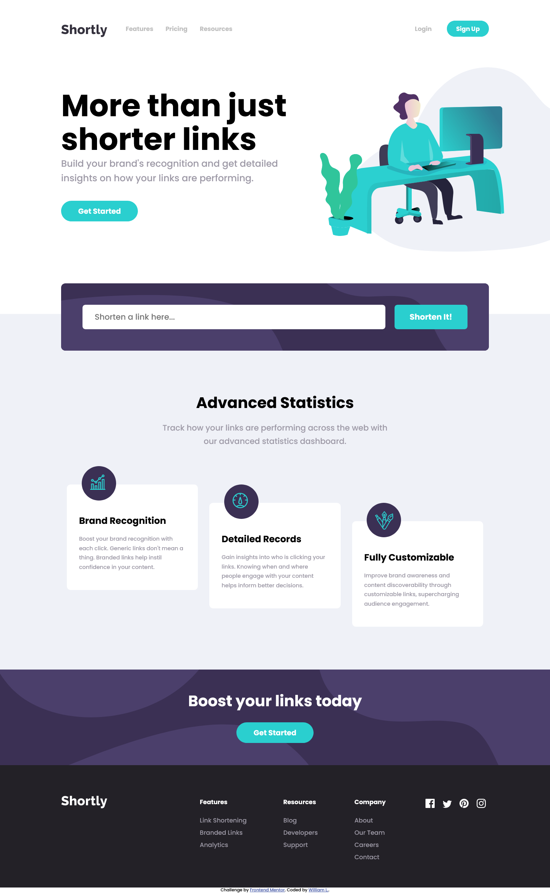

# Frontend Mentor - Shortly URL shortening API Challenge solution

This is a solution to the [Shortly URL shortening API Challenge challenge on Frontend Mentor](https://www.frontendmentor.io/challenges/url-shortening-api-landing-page-2ce3ob-G). Frontend Mentor challenges help you improve your coding skills by building realistic projects. 

## Table of contents

- [Overview](#overview)
  - [The challenge](#the-challenge)
  - [Screenshot](#screenshot)
  - [Links](#links)
- [My process](#my-process)
  - [Built with](#built-with)
  - [What I learned](#what-i-learned)
  - [Continued development](#continued-development)
  - [Useful resources](#useful-resources)
- [Author](#author)
- [Acknowledgments](#acknowledgments)

## Overview

### The challenge

Users should be able to:

- View the optimal layout for the site depending on their device's screen size
- Shorten any valid URL
- See a list of their shortened links, even after refreshing the browser
- Copy the shortened link to their clipboard in a single click
- Receive an error message when the `form` is submitted if:
  - The `input` field is empty

### Screenshot

### Links

- Solution URL: [GitHub](https://github.com/Kwill3/shortURL-api-landing-page)
- Live Site URL: [GitHub Pages](https://kwill3.github.io/shortURL-api-landing-page/)

## My process

### Built with

- Semantic HTML5 markup
- SASS
- Flexbox
- CSS Grid
- Javascript
- [shrtcode API](https://shrtco.de/docs/)
- Mobile-first workflow

### What I learned

I learnt how to use Javascript:
- to style input elements in forms. This can help the user put in the correct inputs.
- to clear input after submit button is clicked
- to change and toggle element classes

- I have already been introduced to CSS Grid but this was the first time I am actually using it in a project and I have to say that CSS Grid really makes positioning of elements so much easier and intuitive. Using it to create a project that incorporates Responsive Web Design is the way to go.

- When overflowing an element with ellipsis, the root container also needs overflow to be set to hidden otherwise the element will overflow and stretch the page width.

### Continued development

- Halfway into this project I just learned that use of `@import` in SASS has been deprecated and I should have been using `@use` or `@forward` instead. I will probably familiarise myself with them in the next project.

### Useful resources

- [Build a Responsive Website Using HTML & SASS/SCSS Tutorial](https://www.youtube.com/watch?v=pk-MEjUINjI) - This video taught me to use SASS modularly.
- [Learn CSS Grid in 20 Minutes](https://www.youtube.com/watch?v=9zBsdzdE4sM) - This is an amazing video that goes through in-depth explanation on how to use CSS Grid.
- [How To Write Mobile-first CSS](https://zellwk.com/blog/how-to-write-mobile-first-css/) - A brief article on designing mobile first applications.
- [Basic concepts of flexbox](https://developer.mozilla.org/en-US/docs/Web/CSS/CSS_Flexible_Box_Layout/Basic_Concepts_of_Flexbox) - This article by Mozilla really helped me put into practise the flex grow and shrink properties when I am trying to flex my input responsively without changing my button size.

## Author

- GitHub - [William Lee](https://github.com/Kwill3/)

## Acknowledgments

- [Web Dev Simplified Youtube Channel](https://www.youtube.com/c/WebDevSimplified) - This channel helped me immensely while I was working on this project, a lot of the videos helped me when I got stuck with a particular function that I was trying to implement.